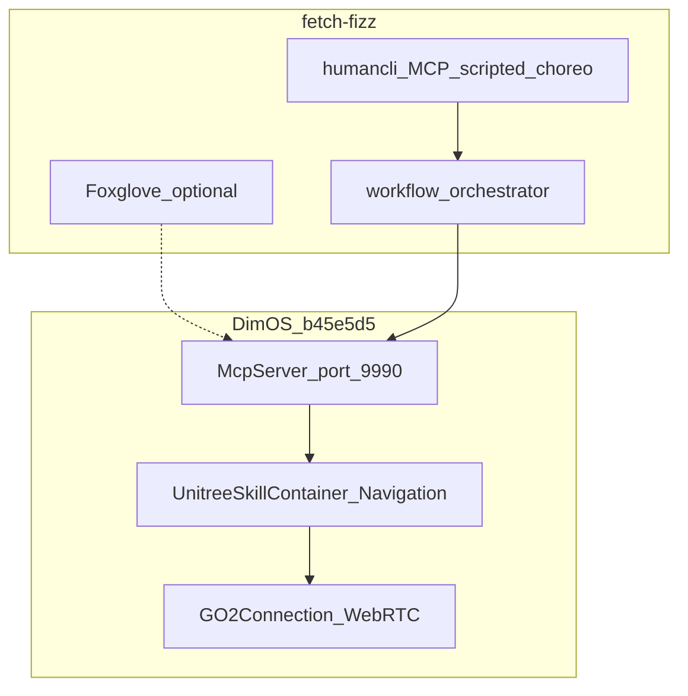

# Architecture

fetch-fizz is an **application repo** on top of DimOS. DimOS handles robot I/O; this repo handles choreo, prompts, and team skills.

## Layers

| Layer | Path | Responsibility |
|-------|------|----------------|
| Blueprint | `blueprints/team_demo.py` | Wire DimOS modules together |
| Skills | `skills/` | Team `@skill` tools via MCP |
| Workflow | `workflow/` | Multi-modal LLM orchestration (Phase B+) |
| Docs | `docs/` | Runbooks, onboarding, ADRs |

## Custom blueprint

`blueprints/team_demo.py` composes:

- `unitree_go2_spatial` — nav + mapping stack
- `McpServer` + `McpClient` — agent loop
- `_common_agentic` — navigation, follow, sport, speak, web input
- `TeamSkillContainer` — hackathon-specific skills

Run with `uv run python scripts/run_demo.py`.

## Control surfaces

| Surface | Required? | Use |
|---------|-----------|-----|
| `humancli` | Primary | Natural language → skills |
| MCP `:9990` | Primary | Scripted choreo, workflow, tests |
| DimOS web `localhost:7779` | Built-in | Browser chat via `WebInput` |
| Foxglove | Optional | Costmap click-nav — [foxglove.md](foxglove.md) |

## Upgrading DimOS

1. Change commit hash in `pyproject.toml`
2. `uv lock && uv sync`
3. Run `make test`
4. Hardware smoke on Go2 before merging

Fork dimos only when you must patch code inside the upstream package.

## ADRs

- [001-llm-boundary.md](adr/001-llm-boundary.md) — MCP/skills boundary, no fork for LLM work
